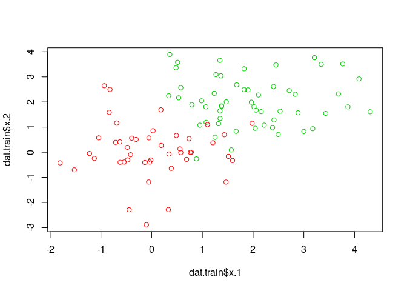
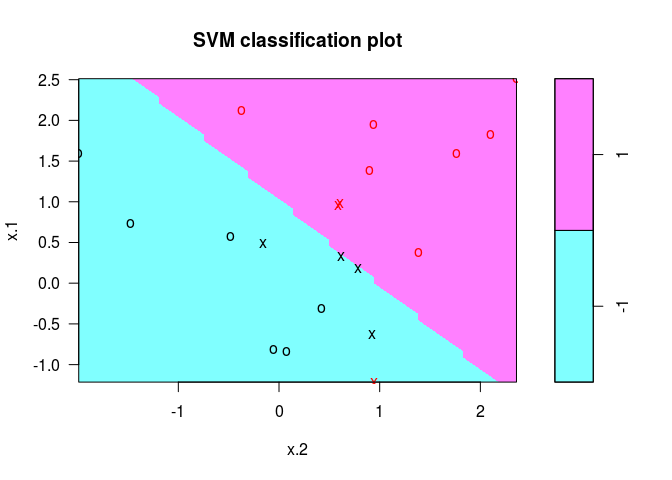

支持向量机算子介绍
================

-   [功能和使用场景](#功能和使用场景)
    -   [使用场景](#使用场景)
    -   [关键参数](#关键参数)
-   [测试用例](#测试用例)
    -   [二分类](#二分类)
    -   [多分类](#多分类)

功能和使用场景
==============

使用场景
--------

支持向量机（SVM）主要用于求解分类问题。 经典SVM算法用来处理二分类问题，扩展后可以用于求解多分类问题。

SVM的基本原理是在训练集所在的超空间中找到一个能够划分训练数据的最大间隙的超平面，根据核函数的不同，超平面可以是线性的或者非线性的，可以允许一定程度的训练错误率，以降低过拟合风险。

优点：适应各种数据特征，精度高、预测速度快；

缺点：需要的训练数据量相对较大，黑盒预测（特征空间变换后，各个维度没有明确的业务含义）。

适用场景：数据区分度好，样本量大，精度要求高，不需要高解释能力。

关键参数
--------

按照重要程度，SVM的主要参数包括：

-   核函数：主要有线性、多项式和径向函数3种；

-   cost：超平面的容错性指标，cost越高，容错性越低，margin越窄，bias越低，variance越高；

-   degree：多项式核中多项式的次数，次数越高边界越“柔软”；

-   gamma：径向核参数，gamma越大，bias越高，variance越低。

测试用例
========

二分类
------

``` r
library(e1071)
set.seed(1)
x <- matrix(rnorm(20 * 2), ncol = 2)
y <- c(rep(-1, 10), rep(1, 10))
x[y == 1, ] <- x[y == 1, ] + 1

plot(x, col = (3 - y))
```



``` r
dat <- data.frame(x = x, y = as.factor(y))
svmfit <- svm(y ~ ., data = dat, kernel = 'linear', cost = 10, scale = FALSE)
plot(svmfit, dat)
```



多分类
------
